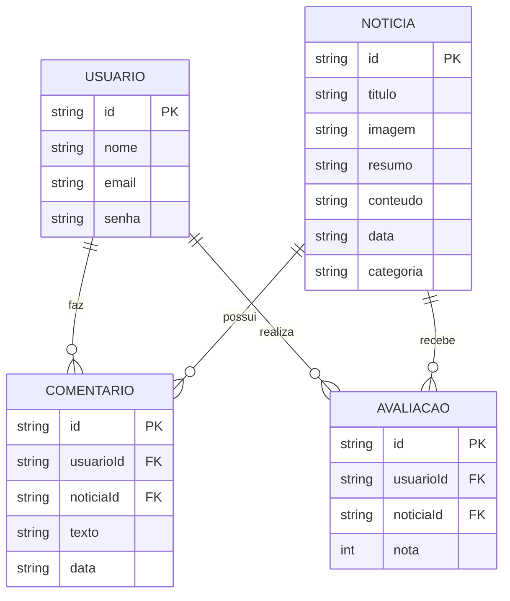

# 🛠️ Especificação Técnica (Tech Spec) – ContraTerra

Este documento descreve a estrutura de dados, relacionamentos e organização da API Fake (JSON Server) utilizada pela aplicação.

---

## 1. 📊 Modelo de Dados (Diagrama ER)



---

## 2. 📖 Dicionário de Dados

### 👤 Usuários (`users`)

Responsável por armazenar dados de autenticação.

* `id`: Identificador único gerado pelo JSON Server
* `nome`: Nome do usuário
* `email`: Usado para login
* `senha`: Senha do usuário

---

### 📰 Notícias (`news`)

Armazena os conteúdos exibidos na plataforma.

* `id`: Identificador único
* `titulo`: Título da notícia
* `imagem`: URL da imagem
* `resumo`: Pequena descrição
* `conteudo`: Texto completo
* `data`: Data da publicação (formato ISO)
* `categoria`: Tipo (filme, série, game, etc.)

---

### 💬 Comentários (`comments`)

Registra comentários feitos pelos usuários.

* `id`: Identificador único
* `usuarioId`: Referência ao usuário
* `noticiaId`: Referência à notícia
* `texto`: Conteúdo do comentário
* `data`: Data do comentário

---

### ⭐ Avaliações (`reviews`)

Armazena notas atribuídas pelos usuários.

* `id`: Identificador único
* `usuarioId`: Referência ao usuário
* `noticiaId`: Referência à notícia
* `nota`: Valor de 0 a 5

---

## 3. 🔗 Regras de Relacionamento

* Um **usuário** pode:

  * fazer vários comentários
  * realizar várias avaliações

* Uma **notícia** pode:

  * ter vários comentários
  * ter várias avaliações

* Cada **comentário** pertence a:

  * 1 usuário
  * 1 notícia

* Cada **avaliação** pertence a:

  * 1 usuário
  * 1 notícia

---

## 4. 🌐 Rotas da API (JSON Server)

Principais endpoints:

* `GET /users` → lista usuários

* `POST /users` → cria usuário

* `GET /news` → lista notícias

* `GET /news?id=1` → detalhe de notícia

* `GET /comments?noticiaId=1` → comentários de uma notícia

* `POST /comments` → criar comentário

* `GET /reviews?noticiaId=1` → avaliações

* `POST /reviews` → criar avaliação

---

## 5. 🗂️ Estrutura do Banco (db.json)

Exemplo simplificado:

```json
{
  "users": [
    {
      "id": "1",
      "nome": "Ana",
      "email": "ana@email.com",
      "senha": "123456"
    }
  ],
  "news": [
    {
      "id": "1",
      "titulo": "Novo filme anunciado",
      "imagem": "img.jpg",
      "resumo": "Resumo da notícia",
      "conteudo": "Conteúdo completo da notícia",
      "data": "2026-03-20",
      "categoria": "filmes"
    }
  ],
  "comments": [
    {
      "id": "1",
      "usuarioId": "1",
      "noticiaId": "1",
      "texto": "Muito bom!",
      "data": "2026-03-21"
    }
  ],
  "reviews": [
    {
      "id": "1",
      "usuarioId": "1",
      "noticiaId": "1",
      "nota": 5
    }
  ]
}
```

---

## 6. ⚙️ Regras Técnicas Importantes

* IDs são gerados automaticamente pelo JSON Server

* Relacionamentos são feitos via:

  * `usuarioId`
  * `noticiaId`

* Validações (frontend):

  * nota entre 0 e 5
  * campos obrigatórios
  * usuário precisa estar logado para comentar/avaliar
